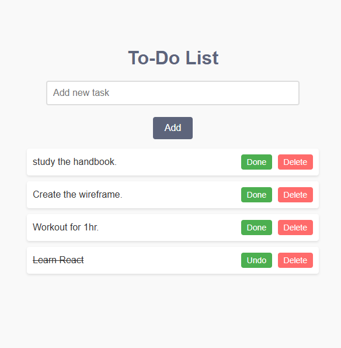

# To-Do List Web App

A simple and intuitive To-Do List web application built using **Golang** for the backend and **HTML**, **CSS**, and **JavaScript** for the frontend. This app allows users to manage their tasks efficiently by adding, deleting, and marking tasks as done or undone.

 <!-- Add a screenshot of your app here if available -->

## Features

- ✅ **Add new tasks**: Easily add new tasks to your list.
- ✅ **Delete tasks**: Remove tasks you no longer need.
- ✅ **Mark tasks as done/undo**: Toggle tasks between completed and incomplete.
- ✅ **Simple and clean UI**: A user-friendly and visually appealing interface.
- ✅ **Golang backend**: Fast and efficient backend powered by Golang.

## Technologies Used

- **Backend**: Golang
- **Frontend**: HTML, CSS, JavaScript
- **Styling**: Modern CSS for a clean and responsive design

## How to Run the Application

### Prerequisites

- Go installed on your machine ([Download Go](https://golang.org/dl/))
- A modern web browser

### Steps

1. **Clone the repository**:
   ```bash
   git clone https://github.com/alii-alqassab/To-Do-List.git
   cd todo-list-app